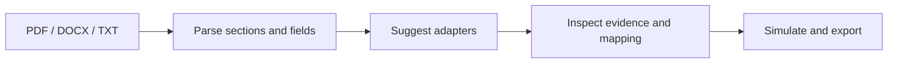

# FinSpark

[Open the hosted workbench (access restricted)](https://finspark-integration-workbench.y63753374.chatgpt.site/) · [Deployment guide](docs/deployment.md)

Source repository: [yatharth7115/FinSpark](https://github.com/yatharth7115/FinSpark). This copy includes the restructured frontend, backend, documentation, examples and automated checks from the original [FinSpark project](https://github.com/Adwik1-2/FinSpark).

**An inspectable workbench for financial API integration.**

Read a financial requirements document, extract fields, suggest API adapters, and simulate a workflow. Select a requirement to inspect its source evidence and connections before writing an integration.

## Explore

The application opens with a fictional loan specification. Without accounts or API keys, you can inspect requirements, explore eight adapter templates, simulate a workflow, and export the plan. TXT documents can be analyzed in the browser with keyword rules. PDF and DOCX processing requires a connected FastAPI service and an account.

**Simulation does not verify identities, make lending decisions, send SMS, or move money.** Adapter definitions are templates, not connected financial providers. Suggested mappings and heuristic scores require human review.

## Workflow



## Quick start

Requirements: Node.js 22, npm, Python 3.12.

```sh
cd frontend
npm ci
npm run dev
```

Open `http://localhost:5176`. Samples and local TXT analysis work immediately.

For backend processing, use a second terminal:

```sh
cd backend
python -m venv .venv
# Windows: .venv\Scripts\activate
# macOS/Linux: source .venv/bin/activate
python -m pip install -r requirements.txt
python -X utf8 -m uvicorn app.main:app --port 8001
```

In **Settings**, enter `http://127.0.0.1:8001`, choose **Test & save connection**, and sign in. Account creation requires SMTP email verification. Environment variables are documented in [Setup](docs/setup.md).

## Structure

```text
frontend/                  React + TypeScript + Vite
  src/lib/                 Browser analysis, API client, adapter definitions
  src/legacy/              Recovered original frontend for reference
backend/
  app/api/                 HTTP routes and schemas
  app/services/            Parsing, analysis, mapping, document history
  app/core/                Configuration and authentication helpers
  app/db/                  SQLAlchemy database and models
  tests/                   Workflow and authentication checks
docs/                      Setup, architecture, deployment, migration
examples/                  Fictional requirements
.github/workflows/         Automated frontend and backend checks
render.yaml                Backend hosting blueprint
```

## Validate

Frontend: run `npm run build` from `frontend`.

Backend: install `requirements-dev.txt`, then run `python -X utf8 -m pytest -q` from `backend`.

## Documentation

- [Setup](docs/setup.md)
- [Architecture and data handling](docs/architecture.md)
- [Hosting](docs/deployment.md)
- [Migration](docs/migration.md)
- [Contributing](CONTRIBUTING.md)

This is a prototype for integration planning. The original multilingual assistant and earlier UI remain in `frontend/src/legacy`, outside the active bundle. The mock admin router and hardcoded admin seeder were removed. Optional external Hugging Face inference remains available in the Python engine; it was not tested without a key.
